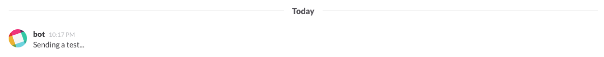

# Usage

Since all of the API methods that are implemented follow the original API's naming scheme directly,
we simply suffice here to show you an example about only one of the API methods.

If you look at how the code looks below, it is simple a matter of copying it and changing the method slug
(chat.postMessage here). The arguments required for each method can be found in the official documentation [here](https://api.slack.com).


## Sending something to Slack

Sending something like a chat-message is pretty simple:
```php
// Acme\DemoBundle\Controller\MySlackController
$helper   = $this->get('cl_slack.api_method_helper');
$response = $helper->send('chat.postMessage', [
    'text'    => 'Sending a test...',
    'channel' => '#test'
]);
// ...
```

In Slack, that should give you something like this in the ``#test`` channel:



## Handling the response

When you run this for the first time you may find that no message is actually sent.
This could be for many reasons, but most often it's because the channel you gave does not exist in your Slack Team.
It could also be that the API token you configured in ``app/config/config.yml`` is wrong (the configured token is used if you do not pass it as one of the options yourself).
To get a better picture of what actually went wrong, you can use the response from Slack to find out.

*As a sidenote, even the response is following the same scheme defined in the official Slack API documentation,
so it should feel familiar if you checked it out beforehand.*

```php
// $response = $helper->send('theMethod.slugHere', [...]);
// ...
if (!$response->isOk()) {
    switch ($response->getError()) {
        case ApiMethodResponseInterface::ERROR_CHANNEL_NOT_FOUND:
            throw new \InvalidArgumentException(sprintf("Wait a tick... That channel does not even exist! Given: %s", $channel));
            break;
        case ApiMethodResponseInterface::ERROR_INVALID_TOKEN:
            throw new \InvalidArgumentException("Wait a tick... We got the wrong token configured!");
            break;
        default:
            throw new \InvalidArgumentException($response->getError());
    }
}
```


# Got it?

Check out the next chapter about working with the [API Commands](api-commands.md).
